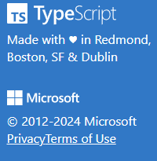

### 1. Comprometimento com a simplicidade

Os desenvolvedores atuando no projeto tem que se comprometer a escrever códigos simples para que possa ser usado por qualquer técnologia

### 3. ferramentas focadas em compatibilidade

- [TypeScript](https://www.typescriptlang.org/) Adiciona tipagem e transpilação do JavaScript comum para uma versão escolida.   

- [tsup](https://tsup.egoist.dev/) uma ponte entre TUDO QUE É SUPORTADO PELO NODE.JS   

### Ferramentas de comparação de versões de suporte

- [CanIuse](https://caniuse.com/?search=ECMAScript)
- [compat-table](https://compat-table.github.io/compat-table/es2016plus/)
